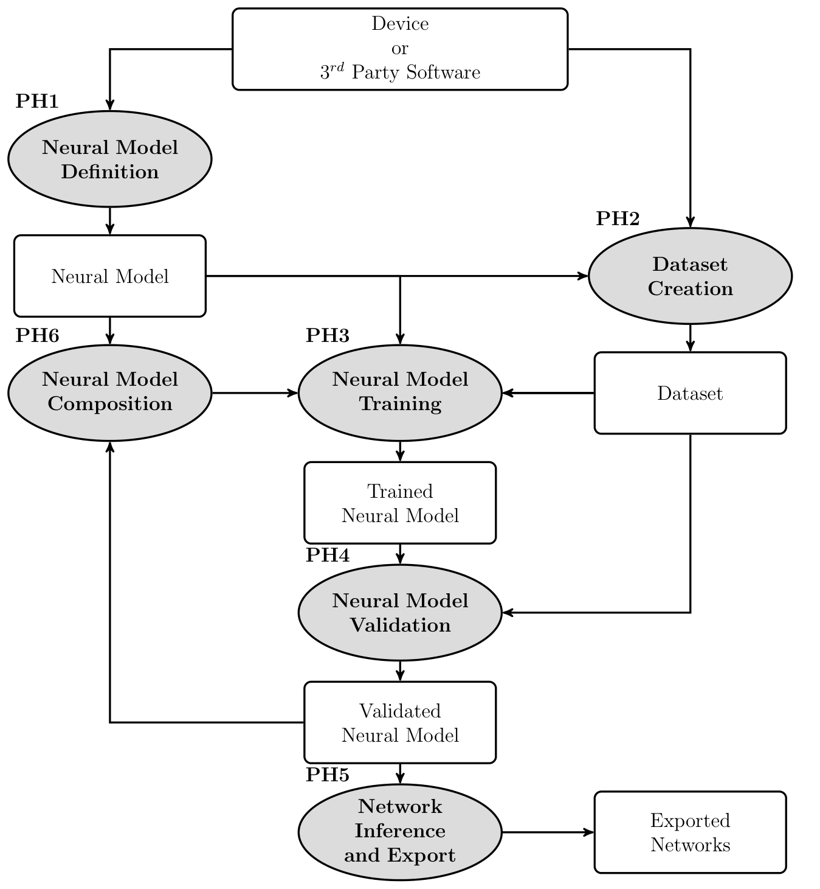

nnodely
=======

.. image:: _static/logo_white_info.png
   :target: https://github.com/tonegas/nnodely
   :alt: nnodely

*nnodely* is a framework for building and deploying **Model-Structured Neural
Networks** (MS-NNs).

Modeling, control and estimation of physical systems impose constraints that
differ from typical deep-learning tasks. Models often have to respect known
physical laws, run in real time, stay interpretable, and generalize from limited
experimental data. MS-NNs combine the learning capabilities of neural networks
with structural priors grounded in physics, control and estimation theory:

- **Data efficiency**: structural priors let a model learn from limited data.
- **Generalization**: domain knowledge helps the model behave well in unseen scenarios.
- **Interpretability**: every block of the network has a physical meaning.
- **Real time**: the resulting networks are small and can be exported for deployment.

*nnodely* is not a replacement for a general-purpose deep-learning framework.
It is a structured layer on top of `Keras 3 <https://keras.io>`_, so the same
model runs on the TensorFlow, PyTorch or JAX backend.

.. raw:: html

   

     <a href="https://github.com/tonegas/nnodely"
        style="display:inline-block; font-weight:900; font-size:1.2em;
               padding:0.5em 0.9em; border-radius:10px;
               border:2px solid #3981BC; text-decoration:none;">
       Repository
     </a>
     <a href="getting_started.html"
        style="display:inline-block; font-weight:900; font-size:1.2em;
               padding:0.5em 0.9em; border-radius:10px;
               border:2px solid #3981BC; text-decoration:none;">
       Getting Started
     </a>
     <a href="https://github.com/tonegas/nnodely-applications"
        style="display:inline-block; font-weight:900; font-size:1.2em;
               padding:0.5em 0.9em; border-radius:10px;
               border:2px solid #3981BC; text-decoration:none;">
       Applications
     </a>
   

Workflow
--------

.. sidebar:: Development pipeline

   Ellipses are the phases of the pipeline, rectangles the artifacts each phase
   produces.

Working with *nnodely* follows the phases of the diagram:

1. **Model definition**: describe the structure of the network with
   :doc:`inputs, layers and outputs <guide/models>`.
2. **Dataset creation**: turn recorded or simulated signals into training
   samples that match the model's windows with a :doc:`DataLoader <guide/data>`.
3. **Training**: declare what to :doc:`minimize <guide/training>` and train the
   network with any Keras optimizer.
4. **Validation**: score the trained model with system-identification
   indicators and plots with :doc:`validate() <guide/validation>`.
5. **Inference and export**: run the model, save it, or export it to Keras or
   ONNX (see :doc:`guide/export`).
6. **Composition**: reuse trained models as blocks of larger ones (see
   :doc:`guide/composition`).

Contents
--------

.. toctree::
   :maxdepth: 2

   getting_started
   guide/index
   api/index

Indices and tables
------------------

* :ref:`genindex`
* :ref:`search`
